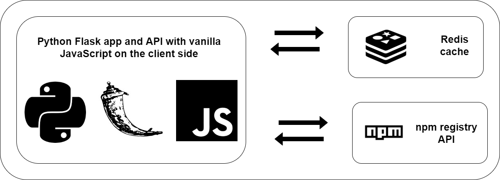

# Dependency Getter

A web app that given an npm package and version returns all its dependencies.

## Architecture

The back end of the app is written in Python Flask it is an API that recieves GET requests, works on the data recieved and checks if a similar call was cached in a redis cache. If the call is in the cache the app returns the response from the cache and if not, it makes a call to the npm registry API using that data, caches the response for 24 hours and returns the response.

The front end is also using Python Flask and renders a jinja2 template with a form where the user can type in the package and version.
Upon submision a JS script makes a call to the back end and presents it to the user.

The Flask app and the Redis cache are both running in Docker containers and are orchestrated by Docker-compose
