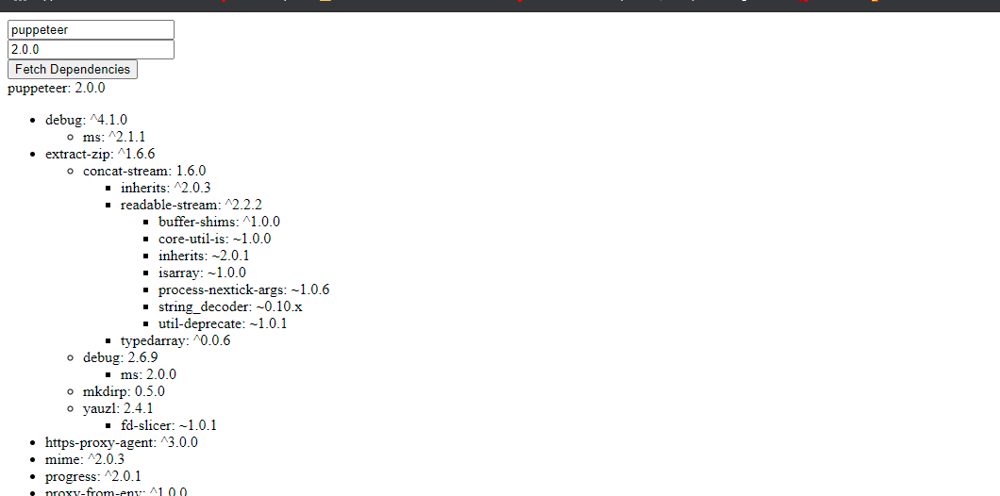

# Dependency Getter

A web app that given an npm package and version returns all its dependencies.

## Architecture

[]()

The back end of the app is written in Python Flask it is an API that recieves GET requests, works on the data recieved and checks if a similar call was cached in a redis cache. If the call is in the cache the app returns the response from the cache and if not, it makes a call to the npm registry API using that data, caches the response for 24 hours and returns the response.

The front end is also using Python Flask and renders a jinja2 template with a form where the user can type in the package and version.
Upon submision a JS script makes a call to the back end and presents it to the user.

The Flask app and the Redis cache are both running in Docker containers and are orchestrated by Docker-compose

## Usage

In order to run this app, from the root library, on the command line type:

```shell
docker-compose up
```

Once it is runnig there are two main ways you can use this app, as an API with curl or as a web app from the browser:

### With curl

On the command line type:

```shell
curl --location --request GET 'http://localhost:5000/<package-name>/<package-version>'
```

For example:

```shell
curl --location --request GET 'http://localhost:5000/jest/latest'
```

Which at the time of writing these lines returns:

```shell
{"deps":{"@jest/core":"^27.0.6","import-local":"^3.0.2","jest-cli":"^27.0.6"},"devDeps":{}}
```

Or:

```shell
curl --location --request GET 'http://localhost:5000/import-local/3.0.2'
```

Which should always return:

```shell
{"deps":{"pkg-dir":"^4.2.0","resolve-cwd":"^3.0.0"},"devDeps":{"ava":"2.1.0","cpy":"^7.0.1","del":"^4.1.1","execa":"^2.0.1","xo":"^0.24.0"}}
```

### In the browser

Navigate to http://localhost:5000. You should see a form with two input boxes, one for package name and the other for package version.

When you submit the form you should get a list of all the requested package's dependencies if they exist.

If the package you request does not exist or your request is in anyway not valid you will not get a response.

When you click on any of the list items in the dependency list a sub tree of its dependencies will open if it has any like in the below screenshot:

[]()

## Things I would have added to the project given more time

- The app as it is is now does not regard the `^` and `~` symbols and simply brings the version listed, for example version `^1.2.3` would bring back vesion `1.2.3`. if a `>` sign is present like so: `>1.2.3` and also in the case of `*` as version, the app will return `latest`. I would probably add a feature that finds the latest relevant version according to the `^`, `~` and `>` symbols.

- I would create an Auto feature in the web app that automatically and asynchronically opens the whole dependency tree, taking into account that some dependencies might require packages that require one of the parent packages, I would keep track of dependencies that were already gotten and not get them again.
